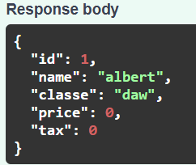

# UF2_FASTAPI
## SWAGGER

### Poodem veure que s'ha creat un altre endpoint anomenat POST amb la ruta "/offers/" que el que fa és crear un nou element amb els camps específics de:
### - name => contindrà el nom de format cadena (string)
### - descpription => serà una breu descripció del producte (string)
### - price => preu del producte (float)
### - items => conté una llista i dins d'aquesta podem veure un altre element amb una propietat de llista. Això es conneix com un camp profundament anidats, és a dir, hi hauràn més especificacions per aquell camp. Això és pot fer per aprofunditzar sobre l'element/ camp creat en el format JSON.

