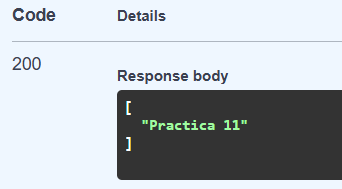

# UF2_FASTAPI
## POSTMAN PUT

### Com podem veure les he ordenat per carpetes (act8 i act9), dins d'aquestes trobem el PUT executat amb el POSTMAN.

## SWAGGER

### Realització del exercici però executat en el SWAGGER.