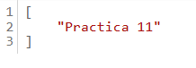

# UF2_FASTAPI
## Tenim una imatge del model relació de la nostra base de dades

# Model de la base que seguiré

# Text principal de la API

# Mostrar jugadors 

# Button jugar partida

# Text jugar partida

# Jugar lletra - POST

## Resultat jugar intent (tirada 1)

# Jugar lletra - POST

## Resultat jugar intent (tirada 2)

# Mostrar alfabet
