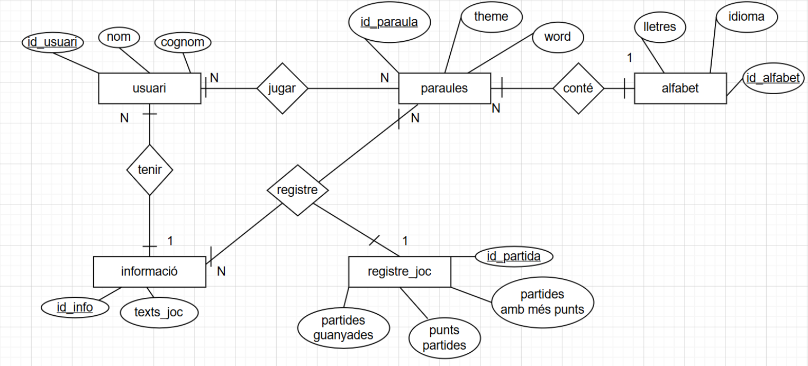
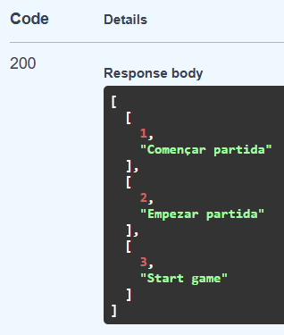
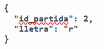

# UF2_FASTAPI
## SWAGGER - GET

## POSTMAN - GET

## SWAGGER - POST

## POSTMAN - POST

## SWAGGER GET - error 404

## POSTMAN GET - error 404

# SWAGGER - raise error 404 

# POSTMAN GET - raise error 404 
